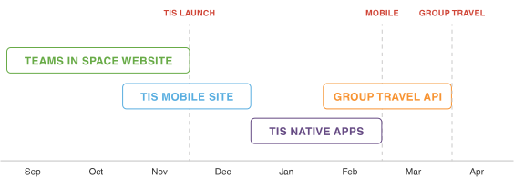
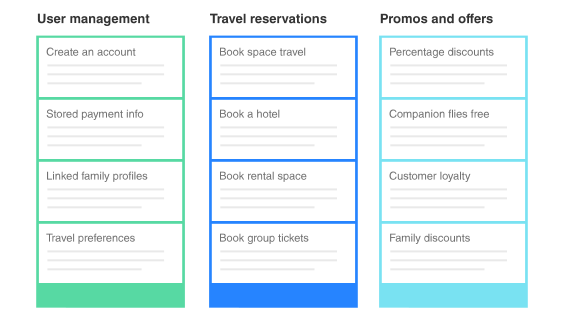

# 统一软件工程流程框架（Unified Software Engineering Process Framework）

> “凡治众如治寡，分数是也；斗众如斗寡，形名是也；三军之众，可使毕受敌而无败者，奇正是也。” 
> ——《孙子兵法-兵势第五》

如果我们把Coding能力很强，能够凭一己之力搞定一切的程序员比作小说中武功高强的剑客，那么一支由多人组成的工程团队就必定是一支军队。如果我们把只有一个人的队伍也看成是“团队”的特殊情况，那么对于这样的“团队”而言，要想完成不那么复杂的任务，他/她只要把自己的个人技艺训练到炉火纯青即可；但对于复杂到一定程度，要处理的事情千头万绪，需要各种专业技能才能完成的任务来说，就必须通过多人团队的方式来完成。人多就一定力量大吗？未必！就算是一支人数众多，由各种各样专业人才组成的队伍，如果没有接受过一定的工程化训练，就不可能做到实战中如臂使指，就会有败亡的危险。反过来，一支实战经验暂时不那么丰富，个人技能稍微要弱一些的队伍，如果接受了一定的工程化训练，能够在实战中通力合作，形成合力，那么他们每个人的力量就会得到加成，他们的经验就会在实践中得到锻炼和加强，失败的可能性就会降低。因此在这个世界上，只要有需要人和人之间相互协作来做成的事情，就一定存在着“系统工程”的思维方式。

软件工程是人类认识世界和改造世界的一个具体的领域，具有一定的客观规律，是“把系统的，有序的，可量化的方法应用到软件的开发，运营和维护上的过程”，它具有复杂性，不可见性，易变性，服从性和非连续性等固有属性。IT从业者有必要认识和把握这样一些规律和属性，以增进技艺，更好地进行软件工程实践活动。本文在邹欣老师的《构建之法：现代软件工程》一书的基础上进行总结和提炼，基于“敏捷软件工程”和“微软解决方案框架（MSF）”构思了一套统一软件工程流程框架，因此可以把它看作是这本书的读书笔记。但正如邹老师说的：“知识体系是构建出来的，而不是接收到的。与其灌输知识，不如自己构建”，于是我在学习的过程中有意识地尝试把书中介绍的各种流程和方法串成一根线，正所谓“阵而后战，兵法之常；运用之妙，存乎于心”，要想达到“运用之妙，存乎于心”的境界，还是要从软件工程的基本思维和基础方法开始修炼起。这也是这篇文章的目的所在。在任何社会活动中，人是最重要和最关键的影响因素，因此下面我们就先来聊聊软件工程师的个人战术素养。

## 一. 软件工程师的个人战术素养

IT行业是知识密集型行业，软件工程师最大的职业风险就是被不断出现的新技术淘汰。一方面，要掌握一些方法和技巧，提高自己的工作效率，尤其是交付的作品的质量；另一方面，把节约出来的时间用于学习新知识和锻炼身体。拓展出来的新技能和强健的体魄又能促进个人价值的最大化，形成增益的良性循环。下面我们就来谈谈有关软件工程师个人战术素养的两个主要方面：开发能力和职业成长。

### 1.1 培养开发能力的几个要素
#### 1.1.1 测试驱动开发

软件工程师首先要做到的就是对自己的代码负责，不管是维护自己的个人项目也好，是完成具体的工作任务也好，交出来的东西要尽量保证质量好，让别人读完文档就能直接拿来用。怎么保证呢？当然是通过测试的方法来保证——软件工程师一定要写单元测试代码，并与功能代码一起维护。单元测试的主要目的是使模块的质量得到稳定的，量化的保证，它还有一个额外的好处，就是提供了代码使用的示例，单元测试如果写的特别完善，别的开发者甚至可以通过阅读单元测试代码来学习和掌握模块的使用。比如下面这段Go语言单元测试代码就展示了怎样在CouchDB中保存一个大的文档数据：

```go
func TestCreateLargeDoc(t *testing.T) {
	var buf bytes.Buffer
	// 10MB
	for i := 0; i < 110*1024; i++ {
		buf.WriteString("0123456789")
	}
	doc := map[string]interface{}{"data": buf.String()}
	if err := testsDB.Set("large", doc); err != nil {
		t.Error(`db set error`, err)
	}
	doc, err := testsDB.Get("large", nil)
	if err != nil {
		t.Error(`db get error`, err)
	}
	if doc["_id"].(string) != "large" {
		t.Errorf("doc[_id] = %s, want large", doc["_id"].(string))
	}
	err = testsDB.DeleteDoc(doc)
	if err != nil {
		t.Error(`db delete doc error`, err)
	}
}
```

编写单元测试需要遵循一些基本的规范：
* 在最基本的功能/参数上验证程序正确性
* 必须由最熟悉代码的人（程序作者）来写
* 测试过后相关状态保持不变
* 测试速度要快，几秒钟内完成
* 测试产生可重复，一致的结果
* 独立性：不依赖于别的测试，可人为构造数据保持测试独立性
* 覆盖所有代码路径，但100%的覆盖率并不代表100%正确性，代码覆盖率对本该实现但并没有实现的功能无能为力
* 能够集成到自动测试框架中
* 和产品代码一起保存和维护

测试前，我们要做一些必要的准备（setup），比如插入一些用于测试的样例数据；测试后我们要清理相关数据（teardown），使测试过后相关状态保持不变。值得注意的是，现代编程语言一般都集成了自己的测试框架。以Go语言为例，我们可以在一个叫TestMain()的函数中编写我们自己的setup()和teardown()函数，并在二者之间运行所有的单元测试代码：
```go
func TestMain(m *testing.M) {
	setup()
	code := m.Run()
	teardown()
	os.Exit(code)
}
```
Go语言规定了凡是以“test”结尾的代码文件都是测试文件，所有的单元测试函数都以Test开头，只要在命令行运行`go test`命令就能自动运行所有的单元测试并输出结果，除此之外Go语言还可以编写Example示例函数来展示函数用法，Godoc工具会使用相关的示例函数自动生成文档，例如下面这个函数展示了标准库中`stringutil.Reverse()`函数的使用方法：

```go
func ExampleReverse() {
    fmt.Println(stringutil.Reverse("hello"))
    // Output: olleh
}
```
随着模块功能的演进，相关的测试用例也在不断演进，这些测试用例集就构成了模块功能的基准线。作为回归测试（Regression Test）的基础，如果有任何一个测试用例失败了，就说明模块的功能从正常工作的稳定状态退化到了不正常的不稳定状态。这样一来，不管是增加新功能还是修复bug，回归测试就能确保新的代码实现了期望的功能或者修复了bug，而没有破坏模块原有的功能。

#### 1.1.2 效能分析工具

除了没有bug，软件工程师通常还希望自己的代码运行的又快又好，效率较高，那么除了必要的单元测试技能外，还需要掌握一定的效能分析工具，这些效能分析工具能够分析代码运行的整理情况，模块和函数之间的调用关系拓扑图，以及每个函数耗费的时间，通过对这些数据进行分析，我们就可以定位代码运行效率较低的位置，进行有的放矢的优化工作。

#### 1.1.3 重视个人开发流程的训练

卡耐基梅隆大学（CMU)的能力成熟度模型（CMMI)是用来衡量一个团队能力的一套模型。CMU的专家们对软件工程师也有一套模型，叫个人软件流程（PSP），PSP2.1展示了一个软件工程师在接到一个任务后应该怎么做：

1. 计划：估计任务需要多少时间
2. 开发：分析需求，生成设计文档，设计复审，代码规范，具体设计，具体编码，代码复审，测试
3. 报告：记录用时，测试报告，计算工作量，事后总结并提出过程改进计划

有丰富经验的工程师会在“需求分析”和“测试”这两方面明显地要花更多时间，但是在编码上，要花更少的时间——花在写代码上的时间反而少了。从我维护个人开源项目的经验上来看，分析需求，生成文档和测试花的时间是最多的。我得先想清楚代码编写的思路，才能粗略估算完成这个任务需要多少时间，特别是对于比较复杂的代码，我会写一篇文章详细阐述关键代码的设计思路，防止时间长了之后自己忘记当初为什么要这样写了，然后我会将功能代码和相关的测试代码发布到Github上，并撰写尽可能详细的说明文档。如果别的程序员对这个项目感兴趣，他们就会通过各种方式和我交流，个别极其认真的还会提出代码的设计缺陷和bug，这也就相当于设计和代码复审了，因此文档作为一种交流工具非常重要。

#### 1.1.4 二人战斗小组

但如果是两个开发人员组成一个小组的话，就可以做一些代码复审的工作了。这在其他行业也经常见到：

* 越野赛车（驾驶，领航员）
* 驾驶飞机（驾驶，副驾驶）
* 狙击小组（狙击手，观察手）

在软件工程领域，我们叫“结对编程”。在进行结对编程前，两位开发人员首先要达成共识——有关代码风格规范和设计规范的共识。风格规范主要是文字上的一些规定，比如花括号的位置，缩进的大小或者函数的命名等等；设计规范牵涉程序设计，模块间关系和设计模式等方方面面。达成共识后，两位开发人员就可以开始正式的结对编程活动了，他们分别扮演驾驶员和领航员的角色，前者控制键盘输入，后者起领航和提醒作用。具体来说，驾驶员写设计文档，进行编码和单元测试，而领航员审阅文档和编，考虑单元测试的覆盖，思考是否需要和如何重构，帮助驾驶员解决具体技术问题。注意驾驶员和领航员要不断地轮换角，任何一个人不要扮演同样角色超一个，每工作一小时休息15分，由领航员控制。在结对编程的活动中，任何一个任务首先都是两个人的责任，要主动参与——大家只有水平上的差距，没有级别上的差异，拥有平等决策权利。

结对编程有很多好处，首先两人合作解决问题，能够提更好的设计质和代码质量，这会给大家带来信心，高质量产出带来更高满足感。这也有利于促进团队成员之间的更有效交流：相互学习和传递经验，分享知识。最后，结对编程还能带来不间断的复审——看代码是否在“代码规范”的框架内正确地解决了问题，越早发现问题越好，越是项目后期发现的问题，修复的代价越大。同伴复审可作为自我复审和团队复审的一个有效的补充形式。复审的目的在找出代码错误，发现逻辑和算法错误，发现潜在错误和回归性错误，发现可能需要改进的地方，以及互相教育传授经验，促进团队成员熟悉项目各部分代码，熟悉应用领域相关实际知识。复审的一个标准流程如下：

1. 代码必须采用最严格编译警告等级成功编译，必要时提供Debug/Retail版本；
2. 程序员必须测试过并提供新的代码；
3. 复审者选择复审方式：面对面，独立复审或者其他方式；
4. 开发者控制流程，讲述修改的前因后果，复审者有权在任何时候打断叙述，给出自己意见；
5. 复审者逐一提供反馈意见，开发者有义务给出详尽回答；
6. 开发者负责确保所有问题得到满意的解释或解答，或确保这些问题得到处理；
7. 最后，达成复审结果一致意见：
	* 若发现致命问题，则打回，解决之前不能签入；
	* 若发现一些小问题，可有条件同意（不需复审，修改后签入）；
	* 代码可以不加新改动，直接签入；
8. 复审后整理记录，更正明显的错误，对无法很快更正的错误记录下来形成bug report，开发把所有错误记录在“我常犯的错误”表中，作为自我复审参考：
	* 症状：从用户角度看，软件出现了什么问题？
	* 程序错误：从代码的角度看，代码的什么错误导致了软件问题？
	* 根本原因：导致代码错误的根源是什么？

##### 1.1.4.1 如何影响对方

影响对方的方式有四种：
1. 断言（Assertion）：“就这样吧，听我的，没错”，感情强烈，适用于有充分信任的同伴；
2. 桥梁（Bridge）：“能不能再给我讲讲你的理由……”，给双方充分条件互相了解；
3. 说服（Persuasion）：“如果我们这样做，根据我的分析，我们会有这样的好处……”，有条理，建立在逻辑分析基础上，即时不能完全说服，对方也可能部分接受；
4. 吸引（Attraction）：“你想过舒适生活么？你想在家里发财么？加入我们吧，几个月后就能有上万收入”，有效地传递信息，但要注意信息准确性，夸大渲染会降低个人可信度；

##### 1.1.4.2 如何正确给予反馈

评论别人有三种层次：
1. 最外：评论别人的行为和结果，对方较容易接受：行为可以改正，后果可以弥补，有挽回局面的机会；
2. 中间：评论别人的习惯和动机，对方较难接受：比较难表白和澄清动机，容易引起误会；
3. 最内：评论别人的本质和固有属性，对方很难接受：无法回应，容易引起冲突和矛盾；

因此如果我们要正确地给予同伴反馈，既要正确地反馈信息让对方接受，又要避免对方造成误会引起矛盾，可以采取“三明治方法“：
1. 做好铺垫（面包）：强调双方的共同点，从团队共同愿景讲起，让对方觉得处于一个安全环境；
2. 建设性意见（肉）：少沉溺于过去，多展望将来，“过去你做的不够，但我们以后可以做的更好”；
3. 呼应开头，鼓励对方把工作做好（面包）；

当然，也不是所有的情况下结对编程都适用。首先，处于探索阶段的项目需要深入思考，不适合进行结对编程；其次，后期维护时，若技术含量不高，只需要有效复审即可；另外，对于要运行很长时间的验证测试，两个人坐在那里等待结果也比较耽误时间；然后如果团队成员在多个项目中工作，也不能充分保证足够的结对编程时间；最后，结对编程需要最大限度发挥领航员作用，若用处不大，则无需结对。

### 1.2 工程师的职业成长路径

#### 1.2.1 个人能力的培养

工程师个人能力的培养主要包含4个方面。首先是技术能力，即软件开发技能，包括对具体技术的掌握（编程语言和开发平台等），动手能力（能够诊断/提高效能）以及软件工程思想；其次是领域知识的积累，包括问题领域的知识和经验，据说有些开发财务软件的公司要求自己的开发人员通过注册会计师考试；然后是一定的职业技能，包括：

1. 自我管理能力：时间管理和解决问题的思维能力
2. 学习能力：
	* π型人才：在哪几个方面追求“专和精”，在哪几个方面追求“知道就好”
	* 如何学习：知识是构建出来的，刻意练习构建心智模型（mindset）
3. 表达和交流能力：能说会写
4. 与人合作能力
5. 按时按质量交付任务能力
	* 项目/任务有多大：代码行数和功能点数
	* 花了多少时间：人数 * 时间
	* 质量如何：交付的代码有多少缺陷？缺陷数量除以项目大小是多少？
	* 是否按时交付：实际用时的平均值和标准差（推崇稳定，一致的交付时间）

最后，工程师一定要重视自己的实际工作成果：

1. 参与的产品用户评价如何？
2. 市场占有率如何？
3. 对用户有多大价值？
4. 你在其中起了什么作用？
5. 参与开源项目，为开源社区做贡献？
 
平时要有意识地训练自己使用STAR原则描述自己的工作：

1. Situation（情景）：简单项目背景，比如规模，软件功能和目标用户；
2. Task（任务）：自己完成的任务，要分清楚“参与”和“负责”；
3. Action（行动）：为了完成任务做了哪些工作，怎么做的；
4. Result（结果）：得到了什么成果，满足了什么需求，有什么贡献；
 
#### 1.2.2 工程师的职业发展

##### 1.2.2.1 认证考试

软件工程师可以参加一些认证考试来证明和提高自己的职业技能。比如软件工程师的职业资格考试——“全国计算机技术与软件专业技术资格考试”，或者参加一些公司的职业认证项目，比如“红帽认证工程师（Red Hat Certified Engineer）”。目前网上有大量的在线教育网站，提供各种MOOC课程，比较有名的有Coursera和Udacity。还有“中国计算机协会计算机职业资格认证考试”和“浙江大学计算机程序设计能力考试”。

##### 1.2.2.2 职业成长

在一般的大公司中，软件工程师的职业成长路径如下所示：
1. SDE（初级软件开发工程师）；
2. SDE II（中级软件开发工程师）；
3. Senior SDE（高级软件开发工程师）；
4. Principal SDE（高级软件开发工程师）；
5. Partner SDE，Distinguished Engineer，Technical Fellow；

软件工程师们平时要努力提高自己的单兵战术素养，多学习，多实践，练好基本功，打好扎实的基础，才能在团队中发挥自己的作用，创造独一无二的价值。有了良好的战术素养作为基础，才能有效地实施软件工程的工作流程，下面我们就正式展开对相关流程的叙述。内容分为两个部分：战略层和战役层。战略层主要介绍的是软件工程的“构思”和“计划”，而战役层面则主要介绍软件工程的“开发”，“稳定”和“部署”。

## 二. 软件工程的实施（战略层）

### 2.1 构思阶段（Envisioning Phase）

构思阶段要完成两个主要工作：组建团队和需求分析。

#### 2.1.1 组建团队

组建一支软件开发团队需要以下6种角色：产品管理，项目管理，开发，用户体验，测试和发布管理。

##### 2.1.1.1 产品管理

产品管理是根据市场和用户需求协调各部门资源（产品定位，市场发展，需求分析，运营，营销，市场推广，商务合作），正确把握产品定位和方向，确保团队理解商业目标和客户需求，解决用户痛点，沟通，计划，收集内外用户反馈，持续优化产品的过程。对应的职位为产品负责人，他/她要带领团队达成最重要目标，并保持团队在以下三个因素上的平衡：

* Feature：功能好
* Resource：资源省
* Time：时间快

对产品负责人的能力有很高的要求，他/她必须能够观察，理解和快速学习，具有同理心，还要有“理解和表达”的专业能力，要能理解不同人心理，需求和言外之意，要能借助文字，图表，草图甚至代码来清晰准确表达自己想法，要能满怀希望向用户兜售产品，向团队兜售希望，要能玩转各种工具，有文字功底，平时有大量的阅读。

作为产品负责人，他/她的具体任务是带领团队形成目标/愿景，把抽象的目标转化为可执行的，具体的和优美的设计。创建并维护软件规格说明书，代表客户和用户利益，主动收集用户反馈，预期用户新需求，协调并决定各种需求优先级。并跟踪项目进展，确保团队发布令客户满意的软件，确保项目保持功能/时间/资源的合理平衡。

##### 2.1.1.2 项目管理

与产品管理不同，项目管理主要是领导软件开发过程，这需要和人以及管理流程打交道，以调配各部门资源和时间，处理和应对不确定性，正确地协调团队内部外部，形成团队风格。此外，按预算和计划管理项目，有效进行风险管理也是项目管理的一部分，对项目开发而言，风险管理有四个层次：
1. 第一层次：没有风险管理，突发事件没有预案，事后进行危机管理；
2. 第二层次：缓和并防止，动员相关方面（团队成员，管理层和合作伙伴）一起想办法防止事故发生，或者进行流程管理：
	* 冲刺阶段不允许修改任何需求
	* 快速迭代，增量改进
	* 结对编程增加团队对代码的了解
3. 第三层次：定量的准备和预计；
4. 第四层次：将问题变为机会；

项目管理对应的职位为项目经理，他/她需要实施解决方案设计，保证一个项目顺利按计划结项。对项目经理最重要的能力要求是分析管理能力和自省能力，具体工作任务有：管理软件的具体功能的生命周期，分析并带领其他成员对缺陷/变更需求形成一致意见并确保实施，收集团队项目管理和软件工程的各种数据，客观分析实施过程中优缺点，推动项目成员持续改进，提振士气。

在微软公司，产品开发的工作实际上兼顾了产品管理和项目管理，有以下6种PM分类：
1. 做功能设计的PM，需深入掌握各个计算机科学分支的专业知识；
2. 对商业和客户有很强了解能力的PM；
3. 具备广泛经验和知识面，以及商业拓展能力的PM；
4. 驱动流程的PM；
5. 专门深入某一领域的PM，比如负责软件的国际化/本地化；
6. 和研究人员合作，琢磨如何将前沿技术引入主流产品，做技术转化的PM；

产品管理和项目管理是产品的创新和过程的创新，二者缺一不可：

> “过程创新可能超越产品创新，但两个创新并驾齐驱则胜于任何一个。” ——著名用户体验专家比尔.巴克斯顿

##### 2.1.1.3 开发

包括若干名系统架构师和软件工程师，主要负责实施具体的开发任务，可根据实际情况再拆分为小组。

##### 2.1.1.4 用户体验

用户体验的角色由产品负责人和UI/UX设计师共同负责，主要工作为：管理用户需求的收集，分析和优先级排序，开发使用场景和用例，为解决方案设计提供反馈，实施用户手册的编写。UI/UX设计师主要负责用户体验中的界面交互设计。

##### 2.1.1.5 测试

测试工程师负责软件开发全阶段与测试有关的数据收集，并配合开发小组设计，实现和维护测试环境。

##### 2.1.1.6 发布管理

由软件工程师负责，主要工作是计划和管理产品部署解决方案。

#### 2.1.2 研究和分析需求

对用户需求的分析和研究是产品负责人的职责，需要产出两个结果：需求规格说明书（requirements）和产品路线图（roadmap）。

在“获取和引导需求”阶段，可以采用用户调查的手段来获得第一手的用户需求：
1. 焦点小组
2. 深入面谈
3. 卡片分类
4. 用户调查问卷
5. 用户日志研究
6. 人类学调查
7. 眼动跟踪研究
8. 快速原型调研
9. A/B测试

然后就可以对需求进行分析和定义，需求可以分为：产品功能性需求，产品开发过程的需求，非功能性需求和综合需求四类。大多数情况下市面上不会只有一款产品为用户服务，所以我们还需要进行竞品分析，有一种竟品分析的方法被称为“NABCD竞争性需求分析框架”：
1. Need：你的创意解决了用户的什么需求？
2. Approach：你有什么独特的招数来解决用户的痛苦？
3. Benefit：这个产品/服务会给客户/用户带来什么好处？
4. Competitors：这个市场有多大？目前有多少竞争者？我方优势在哪里？我方劣势在哪里？
5. Delivery：怎样把你的创新产品交到用户的手中？

需求分析和定义清楚后，就可以向软件产品的利益相关者验证需求了。这些利益相关者包括：最终用户，客户，市场分析师，监管机构和软件工程师。可以通过分析报告，技术原型，用户调查或演示等途径来验证。最后，需求需要得到管理：产品负责人要对需求进行重新审核和相应调整，并确定功能定位和优先级。从第一种维度，我们可以将产品功能划分为核心功能（Core）和外围功能（Context）；从第二种维度，我们可以将产品需求划分为必要需求（Critical）和辅助需求（Enabling），这四种划分结合起来，我们就能得到功能需求分析的四个象限：
1. 第一象限：核心功能+必要需求，建议采取“差异化”方法，全力以赴投资这一领域；
2. 第二象限：外围功能+必要需求，建议采取“抵消”策略，快速地达到“和别人差不多”，对大家都特别看重的功能，采取“优化”的办法达到行业最佳；
3. 第三象限：外围功能+辅助需求，建议采取“维持”策略，以最低代价维持此功能；
4. 第四象限：杀手功能辅助需求，要么维持，要么现在不做等待好时机，要么小规模实验；

最后，产品负责人在做完上面全部工作后，输出一份需求规格说明书和一份产品路线图，产品路线图由一系列的里程碑（Initiative）组成。例如一个叫“Team In Space”的产品路线图如图2-1所示：



### 2.2 计划阶段（Planning Phase）

以构思阶段得到的需求规格说明书和产品路线图为基础，在计划阶段我们要创建产品待办事项清单（Product Backlog），然后将Product Backlog进一步细化为冲刺开发待办事项清单（Sprint Backlog）。

#### 2.2.1 创建产品待办事项清单（Product Backlog）

产品路线图是由一系列的里程碑目标构成的，产品负责人需要将里程碑目标进一步分解为一系列的史诗（Epic）来创建Product Backlog，每个Epic是相互关联的用户故事（User Story）的集合。还是以“Team In Space”为例，该产品的第一个里程碑目标“Team In Space Website”可以进一步分解为三个Epic：“用户管理（User Management）”，“旅行预订（Travel reservations）”以及“推荐及优惠（Promos and offers）”，每个Epic由4个用户故事组成，如图2-2所示。



产品负责人可以根据实际情况决定实现方式：可以选择实现单个Epic的所有用户故事，也可以选择跨Epic实现某一场景/主题，比如“订阅打折机票”。

##### 2.2.1.1 Product Backlog过程中测试要做的任务

在这个阶段，负责测试的开发人员需要完成初步的规划，制定测试计划（总纲），包含以下内容：

1. 产品是什么？
2. 要做什么样的测试？
3. 时间安排如何？
4. 谁负责什么方面？
5. 各种资源在哪里？

#### 2.2.2 创建冲刺开发待办事项清单（Sprint Backlog）

##### 2.2.2.1 交互式系统需求设计

有了Product Backlog就可以创建冲刺开发的待办事项清单，正式开始详细设计了。首先要进行的是“交互式系统需求设计”，常用的设计方法包含三种：典型用户，典型场景，以及用例分析。

###### 2.2.2.1.1 典型用户

光看用户的表面语言或行动还是不够的。我们还要找到用户语言和行动背后的动机。在这种情况下，搞一个“典型用户”会强迫我们在考虑问题时从用户的角度出发。

**典型用户模板**：

1. 名字
2. 性别，年龄
3. 职业
4. 收入
5. 知识层次和能力
6. 生活/工作情况
7. 动机，目的，困难
8. 用户偏好
9. 用户比例
10. 典型场景
11. 典型描述

典型用户代表的只是我们的设想，还需要和这些典型用户代表沟通交流，理解用户，理解他们的工作方式和需要，然后再修改，细化典型用户，最后从典型用户过渡到对典型场景的分析。

###### 2.2.2.1.2 典型场景

有了典型用户之后，还要决定每个典型用户的目标——他/她使用系统想要达到什么目的。对于每一个目标，列出达到目标所必须经历的过程，这就是场景，也可以叫故事。用户和系统可能有成百上千种可能的交互情况，写场景时要有针对性。那么场景该怎么写呢？首先针对每一个场景，设计一个场景入口（描述场景如何开始）。接着描述典型用户在这个场景中所处的内部和外部环境（内部环境指心理因素等）。然后给场景划分优先级，按优先级排序写场景。

**场景/故事的模板**
场景/故事
版权信息/版本信息/维护人信息/版本记录
1. 背景：典型用户，用户的需求/迫切需要解决的问题，以及假设
2. 场景：关于这个场景的文字描述。要列出这个故事中出彩的地方，软件的哪些功能让用户特别满意？逻辑和界面设计要注意哪些因素？第一次使用的用户和多次使用的用户在体验上有何区别对待？场景之间如何区分呢？这就要求我们要找到这个场景的特殊之处，对于共同的流程可以一笔带过，重点描述场景中特殊的因素。
3. 其他资料

把场景组织成一个故事，这样就能把一个完整的用户与系统交互的流程记录下来，以后进行产品演示或验收都可以以此为基础。有了场景，架构设计师就可以和各个模块的负责人一起，沿着子系统/模块的所属关系把场景划分开。例如用户登录场景，就可以分为以下几项：
1. UI层，子任务为：界面设计，资料处理，文件上传处理，编辑控件等；
2. 逻辑层，子任务为：输入字段合法性处理，上传图像逻辑和缩略图处理，资料保存逻辑等；
3. 数据库，子任务为：资料读取的存储过程，图像的索引建立和维护等；

不同的任务将会把一个场景编织起来，虽然有多个开发者参与这项工作，但是应该有一个开发者对整个场景负责，得到开发任务后，我们可以创建和分配对应的测试任务。

###### 2.2.2.1.3 用例分析

用例分析也是很常用的需求分析工具，它有如下一些基本元素：
1. 标题，描述某个用例要达到的目标；
2. 角色，指和软件系统交互的角色，包括用户，其他实体，甚至是时间（一些和时间相关的场景时）；
3. 主要成功场景，一系列步骤（每一步的交互）描述角色是怎样和系统交互，从而达到目标的；
4. 扩展场景，描述一些扩展的交互，例如一些意外情况；

用例分析有很多好处。首先通过讲简单的故事来传递信息是最有效的人与人交流途径，能够促进团队成员对需求的统一了解，把复杂系统当成黑盒子，有助于把重点放在用户的愿望和行动上面，且非常有利于我们找到用户的需求和软件功能点；其次，虽然每个用例都是一个简单的故事，但它们都是整个系统的一部分，有助于保持对全系统的理解，我们不要迷失在长长的功能列表中，而是应该牢记软件的价值在于给用户提供价值；最后，我们可以通过一次完成一个用例来逐步增量地构建整个系统，因为一个用例的完成会触及整个系统的各个层面，不同模块间复杂的依赖关系对团队是一个大的考验，必须适应不断变化的需求。

###### 2.2.2.1.4 软件功能说明书

交互式系统需求设计完成后，需要产出一份软件功能说明书（Functional Spec）。这份说明书从用户角度描述产品功能，不涉及内部实现细节，由产品负责人或有经验的开发/测试来写。而具体的实现则交给开发人员和UI/UX设计人员完成，最后，相关的验证工作由QA质量保障负责。以“系鞋带”为例，一份功能说明书应该有以下主要内容：

1. 定义好相关概念
	* 鞋，鞋带，系鞋带和解鞋带都是什么概念？
	* 系好鞋带的好处是什么？
	* 系鞋带的目标是什么？什么叫做系好了？
2. 规范好一些假设，鞋带是已经穿好在鞋上的么？什么样的鞋属于我们要处理的（拖鞋，凉鞋，球鞋，溜冰鞋和靴子）？
3. 避免一些误解，界定一些边界条件，什么叫“鞋带绑紧了”，打了死结算成功么？要打多少个蝴蝶结才算好？打好的鞋带能拖在地上么？可以列出一些二义性的情况让大家讨论，形成共识，同时还要征求顾客意见；
4. 描述主流用户/软件交互步骤，用明确的步骤说明从“没系好”到“系好”的系鞋带过程；
5. 一些好的功能的副作用要说明，要把这些副作用明明白白写出来；
6. 服务质量的说明，软件团队要说清楚服务质量是什么等级，意味着什么，不然就会人云亦云，以谬传谬；

写好软件功能说明书的秘诀在于“实践，实践，再实践”，乏味和枯燥的文档会扼杀别人的阅读欲望。因此在撰写时要用活生生的人物和故事描述用户是怎样用软件的，遵循KISS原则，保持简单，直接的描述，涉及UI的部分可以直接上图，也可以画表格，不要长篇累牍的文字描述。如果是技术文档最好写上示例代码，单元测试也写好，把边界条件规定清楚，让程序保证Spec正确性，也让读者能够验证Spec正确性。写Spec时，要记录版本的修订时间和负责人，这样出了问题好去找人，Spec中要说明如何验证关于功能的描述，这可以指导单元测试编写，如果使用了一些团队工具的话，最好Spec+测试用例+项目任务，相互链接起来。项目开发中，变化是一定会发生的，要主动挑明哪些部分容易发生变化，提前做好预案——说明哪些部分如果发生改变会有何种连锁反应。最后，做任何改动时，事先参考Spec，事后更新Spec，团队领导人不在没有Spec情况下做拍脑袋决定。

软件功能说明书模板参考：

1. Spec的目标是什么，Spec的目标不包括什么？
2. Spec的用户和典型场景是什么？
3. Spec用到哪些术语，它们的定义是什么？
4. 用户是如何使用软件功能的？
5. 各种边界条件是什么？软件功能应该怎样随之变化？
6. 功能有什么副作用，对于其他功能有什么显性或隐性的依赖关系？
7. 什么叫“好”，什么叫“这个功能测试完了，可以交付了”？
8. 软件发布出去之后，有哪些和项目目标有关的数据可以收集，怎么在实现阶段就能把数据收集的工作准备好？

##### 2.2.2.2 功能驱动的系统概要设计

###### 2.2.2.2.1 第一步：构造总体模型

构造总体模型的进入条件是团队已经选好了问题领域专家，主程序员和架构师。需要完成4个任务：

1. 决定建模小组成员，一般团队成员可轮流参与；
2. 问题领域专家概要介绍问题领域知识。大家学习已有参考资料（建模文件，数据模型，功能需求和用户文档等）；
3. 以不超过3人的小团队构建子问题领域模型，并在适当的时候补充总体模型；
4. 记录模型的信息并保存为文档；

模型构建完成后需要和团队内部或外部的利益相关者验证模型以及它们对用户和业务活动的影响，该阶段工作完成的出口条件是：总体模型已经建好；各个实体（类）的关系也已经表达清楚，各个实体的属性和函数有初步定义；数据流、事件流程等说明文档已经完备。

###### 2.2.2.2.2 第二步：构造功能列表

构造功能列表的进入条件仍然是团队已经选好了问题领域专家，主程序员和架构师。这一阶段的主要任务是要把问题领域描述的活动逐步细化，把大的问题领域分解为小的主题领域。然后描述主题领域中的业务活动，按“<action><result><object>”的格式细化和提炼出来功能描述，估计功能所需时间，超过两周的需要再次细化。

###### 2.2.2.2.3 第三步：制定开发计划

制定开发计划要考虑各种因素，特别是各种实体和功能之间的依赖关系，实体和功能的复杂程度，高风险和高难度的功能要适当提前，这样能让大家早日看到结果，此外各位成员忙闲程度也很重要，最后，还需要考虑对外承诺的演示/Alpha/Beta发布。经过这一步，团队就应该得到：

1. 在每个里程碑中能实现的大致业务活动计划（精确到年/月）；
2. 主题领域完成时间（取决于最后一个功能的实现时间）；
3. 功能实现的先后次序；
4. 功能的相互依赖关系，和功能的所有者的对应关系；
5. 各个功能的复杂程度；

###### 2.2.2.2.4 第四步：功能设计阶段

在这个阶段，团队成员在主程序员带领下，分析一组相关的实体及其功能，通过时序图和其他工具展示各个实体和函数如何动态地结合起来实现一个功能。通过这样的活动，团队成员就开始实现具体的实体和函数。主程序员根据时序图和其他信息更新实体模型。这一步要产出的工作成果是：

1. “这次里程碑要发布的功能”文档，及其相关文档；
2. 各业务活动对应的时序图，更新的实体模型，类/方法/属性；
3. 各成员知道自己的功能实现计划，精确到天；

##### 2.2.2.3 Sprint Backlog过程中测试需要做的工作

测试需要同步跟进，完成测试设计说明书（TDS）的编写。TDS首先描述功能是什么，需要测试哪些方面，特别是有没有预期的bug比较多的地方；其次是如何测试，包括拟采用的具体方法，如何做测试自动化以及准备什么样的测试数据；然后要考虑功能如何与系统集成，如何测试这方面？最后给出Exit Criteria：什么叫测试好了？

## 三. 软件工程的实施（战役层）

我们来回顾一下上面我们都完成了什么工作。首先，我们组建了一支各司其职的开发团队。其次，进行需求的研究和分析，产出需求规格说明书和产品里程碑路线图。紧接着根据需求和里程碑创建由一系列用户故事和Epic组成的Product Backlog（测试工程师编写测试计划）。然后运用“典型用户”，“典型场景”和“用例分析”等方法针对用户故事进行交互式需求设计，产出软件功能说明书，并进行功能驱动的概要设计：构造总体模型，功能列表，制定开发计划，进行功能设计，得到一系列的计划和相关文档。最后，根据这些计划和文档创建Sprint Backlog（测试工程师编写测试设计说明书）。有了前面的工作作为基础，我们终于可以从战略过渡到战役，按照前面的设计进行实际的开发工作，包括3个阶段：开发，稳定和部署。

### 3.1 开发阶段（Developing Phase）

#### 3.1.1 开发人员的标准工作流程

拿到开发任务后，开发人员需要完成一系列的工作，首先要做的是估计开发任务所需时间，可以参考以前同类任务所需时间，如果这方面经验不是很丰富，可以参考其他同事时间估计，然后可以写quick-and-dirty的快速原型代码，遇到问题与PM沟通。对于复杂到一定程度，开发者需要深思熟虑的开发任务，可以写软件技术说明书，又叫设计文档（Technical Spec，Design Doc），用于描述开发者如何实现一组相互联系的功能。编写设计文档需要体现软件设计的一系列原则：

1. 抽象
2. 内聚/耦合/模块化
3. 信息隐藏和封装
4. 界面和实现的分离
5. 如何处理错误情况
6. 程序模块对运行环境、相关模块和输入输出参数有何假设？
7. 应对变化的灵活性
8. 可扩展性：应对大量数据的处理能力

设计过程中可以选择一些图形化建模工具作为辅助，但不是必须的。对于软件工程师而言常用的就是“统一建模语言（UML）”了，但从我自己的实际经验来看，我觉得“思维导图”是一个非常好的整理思路的工具。不管是写文章也好还是写代码也好，边思考边画思维导图，把知识之间的内在联系和框架结构画下来，思路清晰之后再写成代码或者文章，能极大的提高工作效率，特别是对于复杂对象的认识会更全面详细，不会漏掉细节。例如图3-1就是我在阅读邹欣老师的《构建之法》这本书时画的思维导图，同时也是这篇文章的思维导图。


有了设计文文档之后可以按照设计文档写代码，遇到问题与PM沟通。对照设计文档和代码指南进行自我复审，重构代码，并创建或更新单元测试。之后运行单元测试，既要通过自己编写的测试，也要通过整个模块/系统的单元测试并保证代码覆盖率。最后得到一个可测试版本交付给测试人员。如果出现了bug，那么开发人员就需要修复测试人员或用户发现的问题，请同事进行代码复审。然后进一步根据代码复审意见修改代码，完善单元测试和相关文档，进行伙伴测试（可选），最后把代码签入代码库中，这一系列步骤完成之后就得到了一系列完整的，验证过的功能。

伙伴测试的步骤如下：

1. 开发人员找一个测试人员作为伙伴
2. 开发人员做一个包含新模块的私人构建
3. 测试人员在本地做必要的回归/功能/集成/探索测试
4. 发现问题直接与开发人员沟通

项目进入开发阶段后需要进行严格的日常管理以保障代码质量。对于开发人员，要采用“闭门造车”模式——不要随便打断开发人员，尽量减少非开发时间，不要动不动全体会议。对于项目，要进行每日构建（Daily Build），因为即使只是一个简单的系统，团队的积极性也会上升，同时也能保证测试组能及时拿到最新版本进行测试。若开发人员手里的bug超过一定数量，那么就将他/她打入bug地狱，专心修bug。最后，根据燃尽图进行每周进度报告。

#### 3.1.2 开发阶段的测试工作

到了这一阶段，测试小组需要开发一系列的测试用例对已完成的功能进行测试。对于每个测试用例，要写清楚：

1. 如何设置测试前的环境；
2. 如何操作；
3. 预期的结果；

所有的测试用例集合形成一个测试套件（Test Suite），那么测试用例如何设计呢？有很多种方法，这些方法相互补充，帮助测试人员有效地生成测试用例：

1. 等价类划分：每种划分要触发不同的处理逻辑或者错误，有效覆盖程序的各种可能出现问题的地方；
2. 边界值分析：产生测试数据触发各种边界条件，能有效地验证程序在这些地方是否正确；
3. 常见错误：根据经验推测程序通常容易出错的地方，更有效地设计测试用例，例如空文件名，在期望数字的字段填入文字等等；

针对每日构建得到的版本，要进行构建验证测试（Build Verification Test），BVT特指构建完成后自动运行的一套测试，用于验证系统基本功能。BVT有时候需要手工进行，但我们要努力让BVT自动运行，通过BVT的构建被称为可测的（Testable），意思是说团队可以用这一版本进行各种测试，因为它的基本功能是可用的。测试小组拿到一个可测的构建以后，就会按照计划测试各自负责的模块和功能。这个过程叫做验收测试。测试小组还可以进行一定的探索式测试，测试一些一般人不会想到的场景，某些测试可以抽象出来，囊括到以后的测试计划中，作为补充完善的一种手段。

测试过程中，如果发现了问题，就得提交错误报告（bug report）:

1. bug的标题：简要说明问题和严重程度；
2. bug的内容：测试的环境和准备工作，测试的每一步步骤，实际发生的结果，期望发生的结果
3. 其他补充材料：相关联的bug，输出文件，日志文件，调用堆栈的列表，截屏

### 3.2 稳定阶段（Stabilizing Phase）
基本流程
测试小组要做的工作
质量保障
**场景/功能测试报告模板**
1. 场景ID
2. 场景名
3. 测试结果
4. bug ID
### 3.3 部署阶段（Deploying Phase）
版本演进的一般方式
怎样解决影响产品发布的问题
测试小组要做的工作
事后诸葛亮会议
## 四. 总结
## 五. 参考文献
1. [The product backlog: your ultimate to-do list](https://www.atlassian.com/agile/scrum/backlogs)